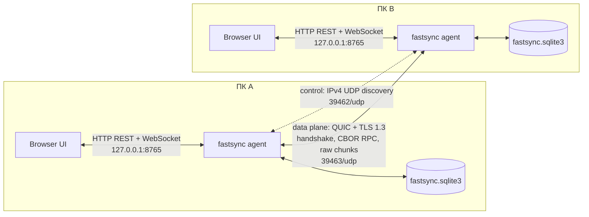

# FastSync

FastSync — локальный агент для аутентифицированной односторонней передачи каталогов между двумя компьютерами в одной сети. Каждый компьютер запускает один и тот же бинарный файл: он поднимает локальную веб-консоль и REST/WebSocket API, объявляет себя через UDP и принимает или отправляет данные по QUIC.

> **Текущий статус:** функциональный MVP `0.1.0`, wire protocol `v2`, SQLite schema `v2`. Это не фоновая синхронизация и не зеркало: пользователь вручную запускает разовую передачу каталога `source -> destination`, лишние файлы на получателе не удаляются.

## Что уже реализовано

В текущем коде работают:

- один бинарный файл `fastsync` со встроенной HTML/CSS/JS-консолью;
- сборка и запуск на Windows и Linux средствами Rust/Cargo;
- IPv4 UDP discovery в LAN и ручной ввод QUIC-адреса;
- постоянный Ed25519 Device ID, взаимно подписанный handshake и явный trust ключа;
- QUIC с TLS 1.3 и параллельными raw chunk-stream;
- режимы сравнения `Fast` и `Verified`;
- BLAKE3 полного файла и фиксированных chunks, повторное использование совпавших chunks;
- job-scoped `.fastsync-stage-<UUID>`, полная проверка перед атомарной заменой и возобновление по сохранённым chunks;
- ограниченный scheduler, pause/resume/cancel, сетевые retry и ошибки отдельных файлов;
- SQLite для identity, известных и доверенных peers, jobs, файлов, chunks и hash cache;
- REST API, WebSocket-события и текущие метрики в UI;
- детерминированный генератор benchmark-данных и локальное сравнение copy strategies.

Не реализованы watcher, автоматическая или двусторонняя синхронизация, mirror/delete, dry run, отдельный controller, пакетирование содержимого маленьких файлов и адаптивный выбор concurrency. Полный список находится в разделе [Ограничения](#ограничения).

## Архитектура workspace



Control plane сейчас находится внутри каждого агента: локальные UI/API создают jobs, меняют trust и читают состояние из SQLite. Отдельного центрального controller нет. Data plane остаётся peer-to-peer: после проверки обоих ключей агенты обмениваются служебными CBOR-сообщениями и raw chunks по QUIC.

| Компонент | Ответственность |
|---|---|
| `crates/fastsync-core` | Модели job/manifest/chunk, сканирование, wire paths, BLAKE3, metadata, partial/finalize |
| `crates/fastsync-protocol` | Типы protocol v2, handshake/discovery, CBOR length framing |
| `crates/fastsync-storage` | SQLite schema/migrations и синхронный persistence API |
| `crates/fastsync-discovery` | Периодический IPv4 UDP broadcast и приём announcements |
| `crates/fastsync-transfer` | Identity, TLS/handshake, QUIC server/client, sender/receiver и resume |
| `crates/fastsync-agent` | Бинарный файл, CLI, HTTP/WS API, JobManager и benchmark-команды |
| `web/index.html` | Встроенная веб-консоль, включаемая в бинарник через `include_str!` |

Подробности: [docs/ARCHITECTURE.md](docs/ARCHITECTURE.md) и [docs/PROTOCOL.md](docs/PROTOCOL.md).

### Почему `rusqlite`, а не `sqlx`

Текущая база — небольшое встроенное хранилище control plane одного процесса. `rusqlite` соответствует этой модели лучше:

- feature `bundled` компилирует SQLite вместе с приложением: внешний сервер БД и установленная системная SQLite не нужны;
- одна connection под `parking_lot::Mutex` даёт простой порядок коротких транзакций и согласуется с SQLite WAL;
- migrations и CBOR payloads полностью контролируются кодом без async pool и compile-time подключения к БД;
- основная нагрузка — сеть, hashing и файловая система, поэтому async SQL pool в MVP не даёт практического преимущества;
- это сохраняет релиз в виде одного исполняемого файла.

Цена решения: операции SQLite синхронны и на короткое время занимают Tokio worker; все обращения внутри процесса сериализованы. При появлении удалённого controller, нескольких writers или тяжёлых запросов это решение нужно пересмотреть, но добавлять `sqlx` заранее в текущей архитектуре нет оснований.

## Сборка

В репозитории нет закреплённого `rust-toolchain.toml` и нет заранее сгенерированного `Cargo.lock`, поэтому используйте актуальный stable Rust с поддержкой Edition 2024. Первый Cargo build разрешит зависимости и создаст lockfile; после этого сохраните его для воспроизводимых release-сборок.

### Windows

Рекомендуемый toolchain — `stable-x86_64-pc-windows-msvc`. Нужны Rustup и Visual Studio Build Tools с workload **Desktop development with C++**: `rusqlite/bundled`, `ring` и другие native dependencies требуют C/C++ toolchain.

```powershell
rustup default stable-x86_64-pc-windows-msvc
cargo build --release -p fastsync
./target/release/fastsync.exe --version
```

Результат: `target\release\fastsync.exe`.

### Linux

Нужны stable Rust и C toolchain. Для Debian/Ubuntu достаточно, например:

```bash
sudo apt-get install build-essential
rustup default stable
cargo build --release -p fastsync
./target/release/fastsync --version
```

Результат: `target/release/fastsync`.

### Один бинарный файл

Для конкретной ОС распространяется только `fastsync`/`fastsync.exe`: UI встроен, SQLite собрана с feature `bundled`, отдельные assets и процесс БД не нужны. При первом запуске рядом с пользовательскими данными создаётся внешняя база состояния, то есть «один бинарник» не означает «без файлов состояния». Windows- и Linux-бинарники разные; готовых installer/service/autostart и code signing в workspace нет. Linux-сборка по умолчанию также не обещает полностью статическую линковку libc.

## Запуск и настройки

Запуск без subcommand включает agent mode:

```bash
./target/release/fastsync
```

На Windows:

```powershell
./target/release/fastsync.exe
```

После строки `FastSync agent started` откройте <http://127.0.0.1:8765/>. Остановка — `Ctrl+C`. Уровень логирования задаётся стандартным фильтром `RUST_LOG`, например `RUST_LOG=fastsync_transfer=debug,info`.

### Адреса по умолчанию

| Назначение | Default | Транспорт | Доступ |
|---|---:|---|---|
| UI и REST/WebSocket | `127.0.0.1:8765` | TCP/HTTP | Только локальный компьютер |
| Transfer endpoint | `0.0.0.0:39463` | UDP/QUIC | LAN после firewall |
| Discovery receive | `0.0.0.0:39462` | UDP | LAN после firewall |
| Discovery send | `255.255.255.255:39462` | IPv4 UDP broadcast | Каждые 3 секунды |

Peer считается online, если последнее announcement моложе `max(3 * discovery_interval, 10 секунд)`. Если discovery не стартовал, transfer и ручной `Probe` продолжают работать.

### Data directory

По умолчанию используется `dirs::data_local_dir()/FastSync`:

- Windows: обычно `%LOCALAPPDATA%\FastSync`;
- Linux: `$XDG_DATA_HOME/FastSync`, либо `$HOME/.local/share/FastSync` при пустом `XDG_DATA_HOME`.

Основной файл — `fastsync.sqlite3`; в WAL mode рядом могут существовать `fastsync.sqlite3-wal` и `fastsync.sqlite3-shm`. В этой БД находятся Ed25519 signing key, TLS private key/certificate, trust pins и resume state. Используйте один и тот же `--data-dir`, чтобы Device ID не менялся, и защищайте каталог правами текущего пользователя. На Unix FastSync выставляет data directory/database в `0700/0600`; на Windows он полагается на inherited ACL выбранного user-local каталога. Удаление БД создаст новую identity и потребует повторного pairing на обоих компьютерах.

### CLI agent mode

| Опция | Default | Назначение/проверка |
|---|---|---|
| `--data-dir <PATH>` | platform local data + `FastSync` | Каталог постоянного состояния |
| `--device-name <NAME>` | hostname, fallback `FastSync device` | Непустое имя в discovery/handshake |
| `--http-bind <ADDR>` | `127.0.0.1:8765` | UI, REST и WebSocket |
| `--quic-bind <ADDR>` | `0.0.0.0:39463` | QUIC transfer endpoint |
| `--discovery-bind <ADDR>` | `0.0.0.0:39462` | IPv4 UDP receive socket |
| `--discovery-broadcast <ADDR>` | `255.255.255.255:39462` | IPv4 broadcast или заданный unicast endpoint |
| `--discovery-interval <SECONDS>` | `3` | Целое значение `1..=3600` |
| `--no-discovery` | выключено | Не запускать UDP discovery; manual connect остаётся |
| `-h`, `--help` | — | Справка Clap |
| `-V`, `--version` | — | Версия агента |

Доступны также subcommands `generate-dataset` (alias `dataset`) и `benchmark` (alias `bench`); точные параметры приведены в [benches/README.md](benches/README.md).

### Firewall

Для default-конфигурации на **обоих** компьютерах разрешите inbound UDP `39462` и `39463` только в доверенном LAN/private profile. TCP `8765` открывать не нужно, пока HTTP слушает loopback.

Windows PowerShell от администратора:

```powershell
New-NetFirewallRule -DisplayName "FastSync discovery" -Direction Inbound -Action Allow -Protocol UDP -LocalPort 39462 -Profile Private
New-NetFirewallRule -DisplayName "FastSync QUIC" -Direction Inbound -Action Allow -Protocol UDP -LocalPort 39463 -Profile Private
```

Linux с UFW:

```bash
sudo ufw allow 39462/udp comment 'FastSync discovery'
sudo ufw allow 39463/udp comment 'FastSync QUIC'
```

Лучше дополнительно ограничить правила своей LAN subnet. При custom bind/port правила должны совпадать с фактическими портами. Не публикуйте `--http-bind 0.0.0.0:8765` без внешней аутентификации/reverse proxy: встроенный HTTP API не имеет login, TLS и authorization.

## Pairing двух компьютеров

Discovery только показывает кандидата. Handshake доказывает владение Ed25519 key, но **не добавляет trust автоматически**. Для передачи A должен доверять ключу B, а B должен отдельно доверять ключу A.

### Через LAN discovery

1. Запустите FastSync на ПК A и ПК B и откройте локальный UI на каждом.
2. Дождитесь карточки второго устройства. Статус `beacon only` означает, что пока получен только неподписанный UDP announcement.
3. На ПК A в карточке ПК B нажмите **Pair / Trust**. Агент A выполнит authenticated probe к ожидаемому Device ID и сохранит public key B в `trusted_peers`.
4. На ПК B в карточке ПК A отдельно нажмите **Pair / Trust**. Это обязательный второй trust pin.
5. Убедитесь, что на обеих карточках показаны `trusted` и `key verified`.

Если выполнен только шаг 3, A доверяет получателю B, но B отклонит все запросы передачи от A как `unauthorized`. Односторонний trust достаточен только для `Ping/Probe`, не для файлов.

### Ручной fallback

Если broadcast заблокирован VLAN, Wi-Fi isolation или firewall:

1. На A в **Manual QUIC endpoint** введите IP/hostname B, например `192.168.1.20` или `192.168.1.20:39463`, и нажмите **Probe**. Для адреса без порта используется `39463`; timeout probe — 5 секунд.
2. После успешного probe нажмите **Pair / Trust** в появившейся карточке B.
3. На B повторите те же действия с адресом A и также нажмите **Pair / Trust**.

Ручное подключение не отменяет второй trust. Запуск с `--no-discovery` меняет только поиск peers.

### Проверка ключей вне канала

UI показывает сокращённый Device ID, поэтому при чувствительной передаче сравните полные значения по независимому каналу. На каждом ПК откройте `GET /api/local`; после `Probe` запись второго компьютера в `GET /api/devices` содержит `id` и `public_key`. Значения A на B должны совпадать с локальными значениями A, и наоборот. Встроенного PIN/QR/PAKE и диалога сравнения fingerprint в MVP нет.

## Запуск передачи в UI

1. Завершите trust на обоих peers.
2. В **Local source directory** вручную введите абсолютный существующий каталог отправителя. Source root не может быть symlink.
3. В **Remote trusted device** выберите получателя.
4. В **Remote destination directory** введите абсолютный путь, который должен существовать или быть создан на компьютере-получателе.
5. Выберите `Fast` или `Verified`, `Concurrency` и `Chunk size (MiB)`.
6. Нажмите **Start Transfer**. Job сразу появляется в **Transfer Ledger**.

Defaults UI/API: `Verified`, chunk `4 MiB`, concurrency `32`, retry limit `6` (retry limit в UI не редактируется). UI не содержит native folder picker: пути вводятся текстом. Destination трактуется агентом получателя; sender принимает native absolute path своей ОС, Windows drive-absolute и UNC forms, а окончательную native-проверку выполняет receiver.

### `Fast` и `Verified`

| Режим | Когда файл считается неизменившимся | Что всё равно проверяется |
|---|---|---|
| `Fast` | Получатель доверяет совпадению `type + size + mtime_ns + read_only` и пропускает файл без чтения содержимого | Для новых/изменённых файлов считаются BLAKE3 chunks; каждый переданный chunk и полный staging file проверяются |
| `Verified` | Metadata недостаточно: source и подходящий existing destination хешируются, идентичное содержимое переиспользуется | BLAKE3 каждого chunk, полный BLAKE3 перед finalize и source mutation checks |

`Fast` не отключает integrity QUIC/chunks. Его риск — ложное совпадение metadata у уже существующего destination. `Verified` устраняет этот shortcut ценой дополнительного чтения дисков. При пустом destination оба режима всё равно хешируют передаваемые файлы.

## Модель безопасности

### Что защищено

- QUIC использует только TLS 1.3 через rustls; трафик зашифрован и защищён от изменения в пути.
- При первом запуске генерируются и сохраняются Ed25519 signing key и self-signed TLS certificate для `fastsync.local`.
- Device ID постоянен: это UUIDv8, детерминированно полученный из первых 16 bytes BLAKE3(public key) с выставленными version/variant bits.
- Client и server отправляют 32-byte nonces, identity fields, public keys и BLAKE3 fingerprint TLS certificate в подписанном application handshake.
- Подпись handshake привязана к текущему TLS certificate/channel. MITM не может заменить certificate, не нарушив Ed25519 transcript signature.
- После явного trust public key закрепляется по Device ID в SQLite. Несовпадение сохранённого и предъявленного ключа — hard authentication failure.
- Discovery address не принимается из JSON: IP берётся из source UDP datagram. До probe announcement всё равно не считается доказательством identity.
- Неtrusted peer может завершить handshake и `Ping`, но остальные protocol requests проверяют pinned key на стороне получателя.
- Relative wire paths запрещают absolute paths, `..`, `.`, пустые компоненты, backslash, drive/UNC forms, NUL/control characters, недопустимые Windows characters, trailing dot/space, reserved device names и `.fastsync-stage-*`. Case-only aliases одного manifest также отклоняются. Destination symlinks и symlink-компоненты отклоняются.

### Границы и ограничения

- TLS certificate self-signed; клиент намеренно не проверяет CA, DNS name или обычную PKI trust chain. Доверие строится на подписанном channel binding и вручную pinned Ed25519 key.
- Первый trust не имеет PIN/QR/PAKE. Пользователь должен сверить Device ID/public key вне канала, если discovery/manual endpoint может быть подменён.
- UDP discovery — неподписанный JSON и раскрывает имя, Device ID, версии и порты в LAN. Он предназначен только для поиска адреса.
- HTTP UI/API по умолчанию loopback, но не имеет аутентификации, HTTPS, role model или CSRF token. Browser-запрос с несовпадающими `Origin` и `Host` отклоняется, но запрос без `Origin` разрешён. Не выставляйте API в сеть напрямую.
- Signing key и TLS private key лежат в SQLite без passphrase и OS keychain. Защита зависит от прав data directory и безопасности учётной записи.
- Данные не шифруются at rest самим FastSync; защищён только network channel.
- **Доверенный отправитель определяет `destination_root` как любой абсолютный путь, доступный процессу получателя.** Нет allowlist, sandbox, quota и подтверждения incoming job на recipient. Peer может создать/заменить файлы там, где у процесса есть права.
- Проверки symlink выполняются перед операциями, но нет filesystem sandbox/openat-style защиты от гонки с локальным процессом, который одновременно меняет path components.
- Удаление trust pin закрывает текущие inbound connections этого peer и отменяет active outgoing runners. Уже завершившая authorization-проверку filesystem operation может успеть закончиться до cooperative cancellation.

## Discovery и manual connect

Announcement — JSON datagram с `device_id`, `device_name`, `protocol_version`, QUIC `port`, `http_port`, `agent_version`, `features`. Принимаются только IPv4 source и exact protocol v2; собственный Device ID и несовместимые версии игнорируются. Максимальный UDP payload — 65 507 bytes. Канал внутренних updates ограничен 128 элементами; устаревшее после backpressure observation отбрасывается.

Default limited broadcast `255.255.255.255` часто не проходит через routers, VLAN, guest Wi-Fi и VPN. Можно указать subnet broadcast/unicast через `--discovery-broadcast` либо использовать **Manual QUIC endpoint**. IPv6 discovery отсутствует. Manual parser принимает explicit IPv6 address, но default QUIC bind тоже IPv4 (`0.0.0.0`), поэтому IPv6 end-to-end не является поддержанным default-сценарием.

## Transfer protocol v2

Полная implementer-спецификация: [docs/PROTOCOL.md](docs/PROTOCOL.md).

Краткий lifecycle:

1. QUIC/TLS 1.3 connection и отдельный framed CBOR handshake stream.
2. Exact version check: поддерживается только `protocol_version = 2`, downgrade/negotiation нет.
3. Sender создаёт одноразовый `manifest_id`, сканирует source и отправляет `CompareBatch` последовательно по 512 entries. Receiver требует строгую sequence и связывает с этим ID все дальнейшие операции attempt.
4. Receiver отвечает `Unchanged`, `NeedHash` или `Conflict`. `Delete` присутствует в enum, но mirror/delete behavior не реализовано.
5. Source считает full/chunk BLAKE3. `HashedFileBatch` содержит до 64 файлов и дополнительно режется по лимиту CBOR frame 16 MiB.
6. Receiver возвращает для каждого файла `missing`, `resumed` и `reused` chunk indices/bytes.
7. Каждый missing chunk идёт в своём bidirectional QUIC stream: `UploadChunk` CBOR header, затем ровно `size` raw bytes, затем chunk acknowledgement.
8. `FinalizeFile` требует active `manifest_id`, согласованный descriptor и полный hash; staging file синхронизируется и атомарно заменяет destination.
9. `CompleteJob` с тем же `manifest_id` применяет metadata каталогов и закрывает job.

Все обычные request/response CBOR frames имеют 4-byte big-endian `u32` length prefix и максимум 16 MiB payload. Untrusted connection до live trust-проверки ограничена request frame в 64 KiB. Raw chunk bytes не являются CBOR frame. Small-file payload batching в v2 отсутствует.

Receiver арендует canonical destination root и все manifest paths за `(peer_id, job_id)`. Пересекающиеся roots/ancestor paths другого job получают retryable conflict до создания path. На final compare batch receiver удаляет только stale runtime/SQLite/staging state предыдущей попытки; final destination files, отсутствующие в новом manifest, не удаляются.

QUIC transport использует keepalive 10 секунд, idle timeout 10 минут и максимум 512 concurrent bidirectional streams. Server дополнительно ограничивает handshake ожиданием 15 секунд, request header ожиданием 30 секунд и raw chunk idle-read ожиданием 60 секунд.

### Resume

Receiver сохраняет файл `destination_root/.fastsync-stage-<persistent UUID>/<relative-path>` и строки `chunks(job_id, path, index, source_hash)`. Staging UUID хранится по `(peer_id, job_id)`, поэтому restart/reconnect находит тот же tree. При повторной попытке с тем же job ID он использует chunk только если:

- staging file — обычный не-symlink файл точного итогового размера;
- full source hash совпадает с записью;
- индекс и descriptor существуют в новой negotiation;
- BLAKE3 соответствующего диапазона staging file фактически совпадает.

Невалидные записи удаляются и chunk передаётся заново. Совпавшие на том же offset chunks существующего destination могут локально копироваться в staging file. После получения всех chunks receiver повторно хеширует весь staging file, делает `sync_all`, применяет mtime/read-only и выполняет атомарную замену; до этого старый destination сохраняется. Успешный job без receiver errors удаляет staging root best-effort; interrupted/failed/completed-with-errors job сохраняет его для resume.

## Scheduler, backpressure и память

Pipeline одного outgoing job:

`scan -> compare batches -> parallel hash -> negotiate batches -> materialize missing work -> parallel upload -> serial finalize -> complete`

Реальные bounds:

- API принимает chunk size `1 MiB..=1 GiB`, concurrency `1..=64`, retry limit `0..=20`; defaults `4 MiB`, `32`, `6`;
- один файл может содержать максимум 131 072 chunks; для более крупного файла sender требует увеличить chunk size;
- hashing одного engine ограничен общим semaphore `available_parallelism().clamp(1, 8)`, даже если job concurrency больше;
- hashing и upload используют `buffer_unordered(job.concurrency)`, поэтому одновременно polling не больше заданного числа work items;
- на каждый активный chunk sender и receiver выделяют по streaming buffer `256 KiB`, плюс QUIC buffers, file handles и runtime state;
- sender хранит полный scan manifest, hashed descriptors и file plans; upload work создаётся лениво, и одновременно polling не больше configured concurrency;
- protocol batch ограничивает размер одного сообщения, но не общий manifest/job в памяти;
- число outgoing jobs глобально не ограничено, но receiver одновременно обслуживает максимум 32 QUIC connections и 64 request tasks;
- SQLite использует одну connection под mutex, WAL, `synchronous=NORMAL` и busy timeout 5 секунд;
- WebSocket event bus имеет capacity 256; отставший consumer получает `{"type":"resync"}` и должен перечитать REST state.

Concurrency не адаптируется к RTT, loss, диску или памяти. При API maximum `concurrency=64` одни только application streaming buffers двух peers могут приблизиться к `64 * 512 KiB = 32 MiB`, не считая QUIC и manifest state. Маленький chunk size также раздувает descriptors, SQLite writes и число streams.

## SQLite schema

Schema version `2`, migrations применяются транзакционно через `PRAGMA user_version`. Основные таблицы:

| Таблица | Содержимое |
|---|---|
| `schema_migrations` | Версии и время migrations |
| `settings` | Typed `string/bytes`; identity/TLS material и receiver staging/manifest tokens |
| `devices` | Discovery/auth observations, optional public key и последний address |
| `trusted_peers` | Pinned public key, address, `trusted_at`, `last_seen` |
| `jobs` | CBOR `TransferJob`, отдельный status/progress CBOR и индексируемые counters/errors/timestamps |
| `job_files` | Status, size, transferred bytes и ошибка по `(job_id, path)` |
| `chunks` | Проверенные resume chunks по `(job_id, path, chunk_index)` и full source hash |
| `hash_cache` | Full/chunk hashes по hash native path + size + mtime + chunk size |

На startup jobs в `scanning/transferring/verifying` и files в `running` переводятся в `interrupted`. Автоматического restart jobs нет: outgoing job нужно возобновить из UI/API. Точная schema и индексы описаны в [docs/ARCHITECTURE.md](docs/ARCHITECTURE.md#sqlite).

## REST и WebSocket API

API возвращает JSON; ошибки имеют вид `{"error":{"code":"...","message":"..."}}`. Неизвестные поля в POST JSON отклоняются.

| Method | Path | Назначение |
|---|---|---|
| `GET` | `/`, `/health`, `/api/health` | UI и health/version |
| `GET` | `/api/local` | Local identity, addresses, versions, features |
| `GET` | `/api/identity`, `/api/devices/local` | Aliases `/api/local` |
| `GET` | `/api/devices` | Merged discovered/trusted peers |
| `POST` | `/api/devices/connect` | Authenticated manual probe: `{"address":"host[:port]"}` |
| `POST` | `/api/devices/{id}/trust` | Probe и pin authenticated public key |
| `DELETE` | `/api/devices/{id}/trust` | Удалить trust pin |
| `POST` | `/api/devices/{id}/untrust` | Alias удаления trust |
| `GET`, `POST` | `/api/jobs` | Список или создание outgoing job |
| `GET` | `/api/jobs/{id}` | Job, progress, pipeline и file errors |
| `POST` | `/api/jobs/{id}/pause` | Поставить outgoing runner на pause |
| `POST` | `/api/jobs/{id}/resume` | Продолжить paused/interrupted/failed/completed-with-errors/pending outgoing job |
| `POST` | `/api/jobs/{id}/cancel` | Отменить outgoing job |
| WebSocket | `/api/events` | `ready`, `device_updated`, `job_updated`, `job_progress`, `resync` |

Пример создания job после bilateral trust:

```bash
curl --fail-with-body -X POST http://127.0.0.1:8765/api/jobs \
  -H 'Content-Type: application/json' \
  --data '{
    "peer_id": "11111111-2222-4333-8444-555555555555",
    "source_path": "/home/alice/bench-source",
    "destination_path": "/srv/fastsync/bench-destination",
    "verification": "verified",
    "chunk_size_mib": 4,
    "concurrency": 32,
    "retry_limit": 6
  }'
```

Допустимо передать ровно одно из `chunk_size`, `chunk_size_bytes`, `chunk_size_mib`; первые два измеряются в bytes. `source_path` должен быть существующим absolute directory без symlink, `destination_path` — absolute path, а `peer_id` — trusted peer.

## Метрики прогресса

`GET /api/jobs/{id}` и UI показывают:

- `total_files`, `completed_files`, `transferred_files`, `skipped_files`, `failed_files`, `symlinks_skipped`;
- `total_bytes`, network payload `transferred_bytes` и локально/после resume учтённые `reused_bytes`;
- `accounted_bytes = min(transferred_bytes + reused_bytes, total_bytes)` и процент по нему;
- текущий `throughput_bytes_per_second`, decimal `throughput_mbps`, decimal `throughput_megabytes_per_second` и ETA;
- `queued_chunks`, оценку `active_chunk_streams/active_file_streams`, configured/current concurrency и последний `current_file`;
- job-level и file-level ошибки.

Throughput — не NIC throughput: JobManager считает delta только `transferred_bytes` между progress snapshots, без CBOR/QUIC/TLS overhead и reused bytes; после 4 секунд без нового sample значение становится нулём. `network/read/write` отражают скорость acknowledged payload, причём `write` означает подтверждённую receiver-запись, а не OS disk counter. `hash` — logical source hashing rate и на cache hits может отражать cache pipeline, а не чтение диска. Active streams являются scheduler estimate, а не измерением Quinn. Incoming job не имеет локального JobManager runner, поэтому его live throughput/progress значительно беднее outgoing view.

## Ошибки, retry, pause и cancel

- Recoverable scan/file errors сохраняются и дают `completed_with_errors`; fatal root/storage/protocol/auth errors завершают job как `failed`.
- Retry выполняется только для network errors, remote errors с `retryable=true` и обрывов protocol I/O. Backoff: `0.5, 1, 2, 4, 8, 15, 15...` секунд; default максимум 6 повторов.
- Каждый retry заново сканирует source, подключается и согласует chunks с тем же job ID; проверенные receiver chunks могут быть reused.
- `Pause` запрещает запуск следующей scheduler operation, но не прерывает уже открытые hash/chunk/RPC operations. После их завершения очередь остановится.
- `Cancel` кооперативно отменяет hashing/RPC, закрывает transfer connection и помечает outgoing job `cancelled`; уже подтверждённые chunks и staging tree могут остаться, но cancelled job через API не resumable.
- При штатном shutdown активный outgoing job получает `interrupted`; при следующем startup resume запускается вручную.
- Incoming jobs управляются sender: pause/resume/cancel из UI получателя отклоняются.

### Изменение source во время передачи

FastSync не создаёт snapshot. Для файлов, дошедших до hashing/transfer, он сравнивает size/mtime/type/read-only до и после hashing, перед каждым chunk и перед finalize; во время отправки chunk повторно считает его BLAKE3 и сравнивает с negotiated hash. Файл, пропущенный `Fast` по совпавшей metadata, после scan больше не читается. Обнаруженное изменение становится ошибкой файла или fatal transfer error в зависимости от стадии. Менять source до завершения job нельзя; для согласованного набора используйте filesystem snapshot самостоятельно.

### Symlink policy

- Source root symlink отклоняется API.
- Вложенные symlinks не следуются и пропускаются; special files также пропускаются.
- Destination root, parent components, target и staging paths не должны быть symlinks.
- Symlinks не копируются и не материализуются на получателе.

## Настройка для 1GbE и NVMe

Проект пока не публикует измеренных performance claims. Начальные значения для собственного измерения, а не гарантии:

| Dataset | Начальная настройка | Компромисс |
|---|---|---|
| Несколько больших файлов на NVMe | chunk `4-16 MiB`, concurrency `8-32` | Больше concurrency даёт параллельные random regions одного файла; проверяйте CPU/NVMe queue |
| Много средних файлов | chunk `1-4 MiB`, concurrency `16-64` | Больше streams/file opens/SQLite updates |
| Много маленьких файлов | concurrency `32-64`, затем сравнить с `1` | Каждый файл всё ещё требует отдельные chunk/finalize streams; batching нет |
| HDD или медленный NAS | concurrency `1-8`, chunk `4-16 MiB` | Меньше seek pressure, но возможен недогруз сети |

Практика измерения:

- используйте `--release`, проводной full-duplex 1GbE и одинаковый MTU;
- сначала измерьте `concurrency=1`, затем `8`, `16`, `32` и только после этого повышайте;
- фиксируйте mode/chunk size, dataset seed, cold/warm filesystem и FastSync hash cache;
- учитывайте Defender/antivirus, CPU governor, thermal throttling и другие I/O jobs;
- наблюдайте CPU, RSS, disk throughput/latency и NIC counters на обоих peers;
- крупный chunk уменьшает число descriptors/streams/DB writes, но ухудшает granularity resume;
- `Verified` может упираться в чтение и BLAKE3, особенно когда destination уже существует;
- не интерпретируйте текущий UI MB/s как end-to-end average или фактические bytes on wire.

## Benchmarks

Генерация default mixed dataset (578 files, 337 641 472 bytes, то есть 322 MiB):

```bash
cargo run --release -p fastsync -- generate-dataset ./bench-data/mixed --profile mixed
```

Локальное сравнение sequential, scheduler concurrency 1 и scheduler concurrency N; сеть и QUIC в этот benchmark **не входят**:

```bash
cargo run --release -p fastsync -- benchmark ./bench-data/mixed ./bench-output --concurrency 8 --json
```

Воспроизводимая локальная и двухмашинная процедура, профили и обязательные метрики: [benches/README.md](benches/README.md).

## Проверки качества

Текущий workspace не содержит отдельной CI-конфигурации. Канонический локальный набор команд:

```bash
cargo fmt --all -- --check
cargo check --workspace --all-targets
cargo clippy --workspace --all-targets --all-features -- -D warnings
cargo test --workspace --all-features
cargo build --release -p fastsync
```

Особенно важный end-to-end тест на loopback:

```bash
cargo test -p fastsync-transfer --test localhost_transfer
```

Он проверяет bilateral pinned identities, Unicode paths, empty/large files, reuse, resume, directory conflicts и cleanup job-scoped staging. Protocol tests отдельно проверяют framing, raw bytes после header и version mismatch.

## Windows, Unicode и пути

- Relative paths в protocol всегда валидный UTF-8 с `/`; кириллица, CJK, diacritics и пробелы поддерживаются и покрыты тестами.
- Native source/destination roots вводятся в синтаксисе локальной ОС. В JSON Windows backslash нужно экранировать: `"C:\\Data\\Source"`.
- Имена, которые нельзя представить как UTF-8, не попадают в wire manifest и записываются как scan errors. На Windows это относится, в частности, к некорректным UTF-16 sequences.
- Windows drive/UNC forms запрещены только для **relative wire paths**, чтобы peer не мог вырваться из destination root. Сам destination root может быть `C:\...` или UNC на Windows.
- Finalize на Windows использует `MoveFileExW(REPLACE_EXISTING | WRITE_THROUGH)`, UTF-16 и добавляет `\\?\`/`\\?\UNC\` prefix; read-only existing destination временно делается writable.
- Остальные scan/open/create операции идут через Rust `std`/Tokio. Отдельного Windows integration test для путей длиннее 260 символов нет, поэтому гарантии end-to-end long-path пока нет. Включите Windows long path policy и тестируйте свой filesystem/toolchain; explicit verbatim root `\\?\...` может понадобиться.
- Reserved Windows names/characters, trailing dot/space, case-only manifest collisions и staging namespace отклоняются до записи. Timestamp resolution всё ещё может различаться между filesystems.
- Sender явно принимает native absolute path, Windows drive-absolute и UNC syntax независимо от своей ОС; receiver затем требует, чтобы путь был absolute по его native rules. Linux sender -> Windows drive/UNC поддержан validation path. Обратный Windows sender -> POSIX root требует отдельного Windows integration test.
- FastSync не выполняет Unicode NFC/NFD normalization. На normalization-insensitive filesystem (в частности, default APFS) канонически эквивалентные, но byte-different имена не считаются надёжно различимыми; такие source trees не являются поддержанным сценарием.

На Linux переносится только mtime и упрощённый `read_only`: ownership, полный POSIX mode, ACL, xattrs, sparse layout и hard-link topology не сохраняются.

## Ограничения

- Нет batching содержимого маленьких файлов по сети: каждый missing chunk использует отдельный QUIC stream, а finalize — ещё один RPC.
- Нет adaptive concurrency, congestion/disk-aware scheduler, bandwidth limit или глобального лимита outgoing jobs; receiver connections/request tasks имеют hard caps 32/64.
- Нет mirror/delete, dry run/plan, отдельного controller, filesystem watcher и bidirectional sync/conflict resolution.
- Нет native folder picker; source и destination вводятся как текст.
- Discovery только IPv4 broadcast/unicast; нет IPv6 multicast/mDNS и routing через subnet boundaries.
- Доверенный peer имеет authority выбирать любой writable absolute recipient path; incoming approval/allowlist/sandbox отсутствуют.
- Нет автоматического resume после restart: outgoing interrupted job требует `Resume`; incoming управляется sender.
- Нет small-file metadata/content aggregation, compression или дедупликации chunks между разными offsets/files.
- Chunk reuse фиксирован по одинаковому index/offset; это не content-defined chunking.
- UI/API не аутентифицированы и предназначены для loopback.
- Identity secrets не защищены OS keychain; at-rest encryption отсутствует.
- Symlinks и special files пропускаются; ownership, ACL, xattrs, hard links, sparse extents и полный Unix mode не переносятся.
- Cross-OS destination validation понимает Windows drive/UNC forms, но Windows sender -> POSIX root и long/UNC paths требуют реального Windows integration coverage.
- В памяти удерживаются полный manifest, hash descriptors и missing-index plans; очень большие деревья/маленькие chunks всё ещё могут потребовать значительную RAM, хотя отдельный список upload work не дублируется.
- Incoming live progress неполон; stage rates являются logical application estimates, а не системными disk/NIC counters.
- Готовых installer/service, release automation, подписанных artifacts и CI matrix Windows/Linux в workspace нет.
- До выполнения и публикации процедуры из [benches/README.md](benches/README.md) нет оснований заявлять throughput, saturation 1GbE или преимущество над другими инструментами.
